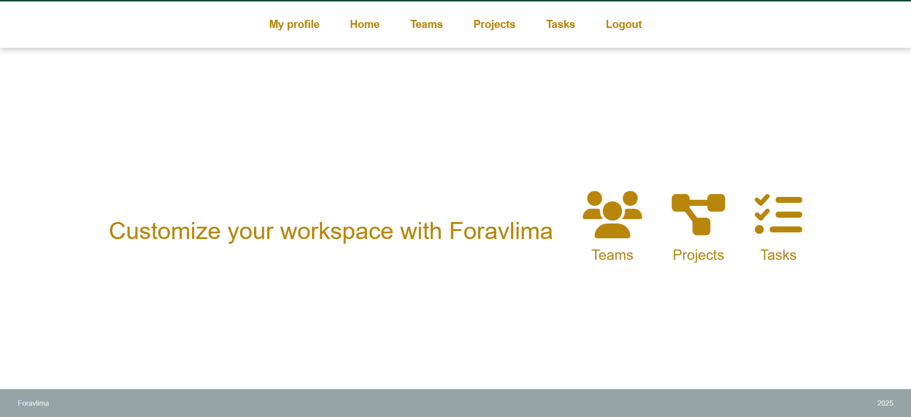
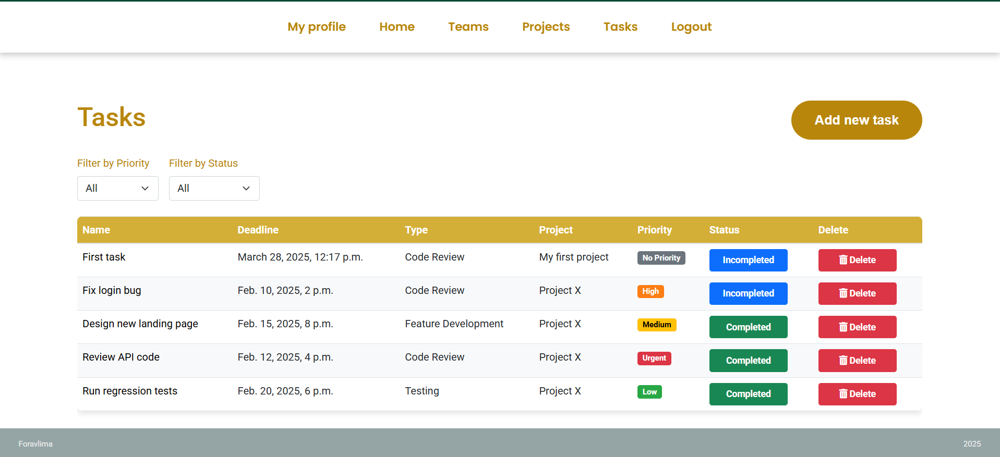

# Foravlima

Welcome to the Foravlima, a simple task manager for developers. This application allows worker create projects, tasks and form teams. Also mark tasks as completed and sort by priorities.

## Features

- **Task Creation:** Users can create tasks and assign them to themselves or colleagues.
- **Task Editing:** Users can update their tasks as much as they want.
- **Task Completion:** Users can mark tasks as completed directly from the task list without opening the editing page.
- **Project Creation:** Users can create their own projects and assign teams to them.
- **Team Forming:** Users can create teams.
- **Authentication:** Login/logout functionality.
- **Registration:** Users can sign up into the system.

## Interface




## On render

https://foravlima.onrender.com/


## Credentials for login

username: admin

password: 1234

## Installation for Windows

```shell
git clone https://github.com/dottfmar/task-manager.git
cd task-manager
python -m venv venv
venv\Scripts\activate
pip install -r requirements.txt
python manage.py migrate
python loaddata data.json
python manage.py runserver
```

## Installation for MacOS

```shell
git clone https://github.com/dottfmar/task-manager.git
cd task-manager
python -m venv venv
source venv/bin/activate
pip install -r requirements.txt
python manage.py migrate
python loaddata data.json
python manage.py runserver
```